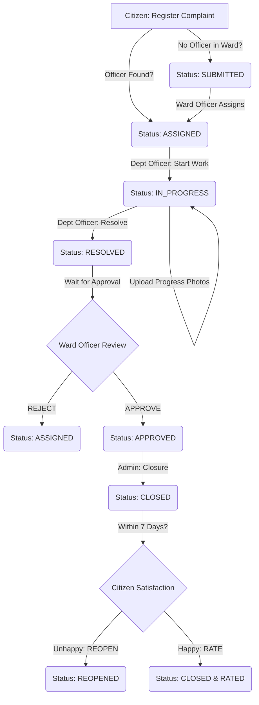

# 🏆 CivicConnect: The Ultimate Complaint Management System Guide

> **Proper and Quick Reference for the Entire Complaint Lifecycle**  
> **Aesthetics**: Premium Tactical | **Logic**: High-Performance Verification  
> **Status**: Verified Production-Ready Backend ✅

---

## 📋 1. Core Workflow Flowchart

---

## 🛠️ 2. Role-Based Action Matrix

| Role | Action | Target Status | Key Details |
| :--- | :--- | :--- | :--- |
| **Citizen** | Register | `SUBMITTED` / `ASSIGNED` | Attaches initial proof photos. |
| **Ward Officer** | Approve | `APPROVED` | Verified on-field work; ready for Admin. |
| **Ward Officer** | Reject | `ASSIGNED` | Send back for rework; status reset. |
| **Dept Officer** | Start Work | `IN_PROGRESS` | Clicks "Start Work"; adds remarks. |
| **Dept Officer** | Resolve | `RESOLVED` | At least 1 "After" photo required. |
| **Admin** | Close | `CLOSED` | Final archiving and SLA finalization. |
| **Citizen** | Reopen | `REOPENED` | Valid for 7 days post-closure. |
| **Citizen** | Feedback | `CLOSED` | 1-5 Star rating + public comment. |

---

## 🚦 3. Complaint Status Reference

| Status | Meaning | Next Step |
| :--- | :--- | :--- |
| **SUBMITTED** | Awaiting manual assignment by Ward Officer. | `ASSIGNED` |
| **ASSIGNED** | Department Officer has been notified but not started. | `IN_PROGRESS` |
| **IN_PROGRESS**| Work is currently happening; progress photos allowed. | `RESOLVED` |
| **RESOLVED** | Work done by Dept Officer; **Awaiting Approval**. | `APPROVED` or `ASSIGNED` |
| **APPROVED** | Ward Officer confirmed work; **Awaiting Closure**. | `CLOSED` |
| **CLOSED** | Task complete. Citizen can now rate. | `REOPENED` (optional) |
| **REOPENED** | Citizen rejected the fix; needs new assignment. | `ASSIGNED` |

---

## 📸 4. Multi-Stage Image Upload Flow

The system tracks work quality through **Image Attribution**:

1.  **STAGE 1: Submission (Citizen)**
    *   *Purpose*: Proof of the problem.
    *   *Action*: Auto-uploaded during registration.
2.  **STAGE 2: Progress (Dept Officer)**
    *   *Btn*: "Upload Progress Photos"
    *   *Condition*: Only when status is `IN_PROGRESS`.
3.  **STAGE 3: Resolution (Dept Officer)**
    *   *Btn*: "Resolve Task"
    *   *Action*: Upload final proof + submit remarks.
    *   *Logic*: Changes status to `RESOLVED`.

---

## ⭐ 5. Public Feedback & Ratings

To "make the best" system, feedback is **Ward-Public**:
*   **Who can add?**: **ALL Citizens** of the ward can add feedback to any resolved/closed complaint.
*   **Visibility**: Accessible to all users in the "Details" page.
*   **Admin View**: Admin can see a heatmap of ratings to identify underperforming sectors.
*   **Persistence**: Feedback is stored with timestamps and user names.

**API Endpoint**: `PUT /api/citizens/complaints/{id}/feedback`

---

## ⏱️ 6. SLA Tracking & Guidelines

Every complaint has an automatic **Service Level Agreement** (SLA) card on the details page:

- **Tracked Statuses**:
    *   `ON_TRACK`: Work is within the allocated timeframe.
    *   `WARNING`: Approaching 80% of deadline.
    *   `BREACHED`: Timeline has passed.
- **SLA Calculation**: Based on Department-specific hours (e.g., Electricity = 48 hrs, Road = 72 hrs).
- **Public Visibility**: Citizens can see the "SLA Countdown" in real-time.

---

## 🔑 7. Frontend Integration Quick-Start

### 📂 Complaint Details Page (The "Best" UI)
Your Details page must include these 4 blocks for maximum efficiency:

1.  **Track Header**: Dynamic status badge + SLA Countdown timer.
2.  **Media Matrix**: Before (Left) | Progress (Middle) | After (Right).
3.  **Timeline History**: A vertical line showing precisely who changed status and when.
4.  **Community Feedback**: Star ratings and comments from ward citizens.

### 🔌 Key Backend Endpoints

#### For Ward Officers (Approvals & History)
*   `GET /api/ward-officer/management/complaints`: View all ward complaints.
*   `GET /api/ward-officer/complaints/pending-approval`: View queue for approvals.
*   `GET /api/ward-officer/complaints/closed-history`: See all complaints in your ward that are now `CLOSED`.
*   `PUT /api/ward-officer/complaints/{id}/approve`: Move to Admin.
*   `PUT /api/ward-officer/complaints/{id}/reject`: Move back to `ASSIGNED`.

#### For Dept Officers (Work)
*   `PUT /api/department/complaints/{id}/start`: Set to `IN_PROGRESS`.
*   `POST /api/department/complaints/{id}/progress-images`: Optional work updates.
*   `POST /api/department/complaints/{id}/resolve-with-images`: Final resolution upload.

#### For Admins (Closure & Registration)
*   `GET /api/admin/complaints/pending-closure-queue`: Detailed list of `APPROVED` complaints ready for closing.
*   `GET /api/admin/complaints/closed-history`: History of all `CLOSED` complaints with full trace.
*   `PUT /api/admin/complaints/{id}/close`: Finalize and archive.
*   `POST /api/admin/register/ward-officer`: Register new Ward officers.
*   `POST /api/admin/register/department-officer`: Register new Department officers.

---

## ✅ Final System Check
- [x] **Auto-Assignment**: Checks for officer presence on registration.
- [x] **Hierarchy**: Ward Officers can Register Dept Officers for their own ward.
- [x] **Traceability**: `ComplaintStatusHistory` logs every single action.
- [x] **Public Trust**: Open feedback loop for all ward citizens.
- [x] **Performance**: Aggregated ratings for ultra-fast load times.

**CivicConnect Backend is fully optimized for the Best User Experience.** 🚀
